# Reference Any Path in Unity


Reference any file or folder from Unity Inspector, whether it's inside or outside your Unity project, and then retrieve the file path in your code.

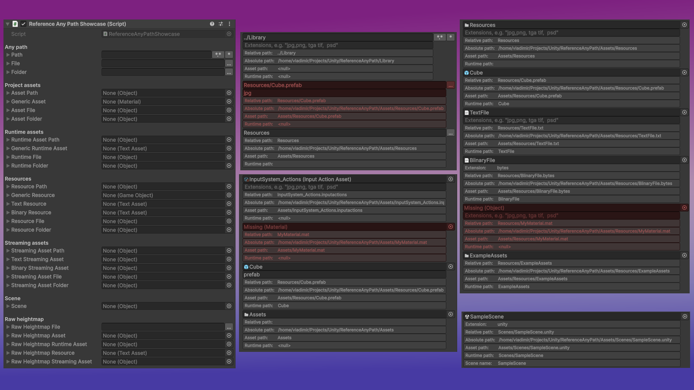

With the help of **Reference Any Path** you can reference Scenes, Raw Heightmaps, Streaming Assets, Resources, Project Assets and nearly anything on your hard drive. Just add a serialized field to your `MonoBehaviour` or `ScriptableObject`, and then drag and drop file or folder either from Project tab of Unity Editor or simply from your system's file browser. The following references are supported:

```csharp
using ReferenceAnyPath;
using UnityEngine;

public class ReferenceAnyPathShowcase : MonoBehaviour {
    [Header("Any path")]
    [SerializeField] AnyPath _path; // Literally any path on your machine
    [SerializeField] AnyFile _file; // Any file on your machine
    [SerializeField] AnyFolder _folder; // Any folder on your machine
    [Header("Project assets")]
    [SerializeField] Asset _assetPath; // Any asset in your Unity project
    [SerializeField] Asset<Material> _genericAsset; // Any asset of specifed type
    [SerializeField] AssetFile _assetFile; // Any asset file
    [SerializeField] AssetFolder _assetFolder; // Any asset folder
    [Header("Runtime assets")]
    [SerializeField] RuntimeAsset _runtimeAssetPath; // Any runtime asset (Resources, Streaming Assets, Scenes)
    [SerializeField] Runtime<TextAsset> _genericRuntimeAsset; // Any runtime asset of specifed type
    [SerializeField] RuntimeFile _runtimeFile; // Any runtime file
    [SerializeField] RuntimeFolder _runtimeFolder; // Any runtime folder
    [Header("Resources")]
    [SerializeField] Resource _resourcePath; // Any resource
    [SerializeField] Resource<GameObject> _genericResource; // Any resource of specifed type
    [SerializeField] TextResource _textResource; // Any text resource
    [SerializeField] BinaryResource _binaryResource; // Any binary resource (*.bytes)
    [SerializeField] ResourceFile _resourceFile; // Any resource file
    [SerializeField] ResourceFolder _resourceFolder; // Any resource folder
    [Header("Streaming assets")]
    [SerializeField] StreamingAsset _streamingAssetPath; // Any streaming asset
    [SerializeField] TextStreamingAsset _textStreamingAsset; // Text streaming asset
    [SerializeField] BinaryStreamingAsset _binaryStreamingAsset; // Binary streaming asset
    [SerializeField] StreamingAssetFile _streamingAssetFile; // Any streaming asset file
    [SerializeField] StreamingAssetFolder _streamingAssetFolder; // Any streaming asset folder
    [Header("Scene")]
    [SerializeField] Scene _scene; // Any scene
    [Header("Raw heightmap")]
    [SerializeField] RawHeightmapFile _rawHeightmapFile; // Any raw heightmap file on your machine
    [SerializeField] RawHeightmapAsset _rawHeightmapAsset; // Any raw heightmap asset in yout project
    [SerializeField] RawHeightmapRuntimeAsset _rawHeightmapRuntimeAsset; // Any raw heightmap runtime asset
    [SerializeField] RawHeightmapResource _rawHeightmapResource; // Any raw heightmap resource
    [SerializeField] RawHeightmapStreamingAsset _rawHeightmapStreamingAsset; // Any raw heightmap streaming asset
}
```

Then in runtime (both in Editor and in Build) you can use the `Path` property to get the path to the referenced asset (if it is available in runtime).

`AbsolutePath`, `RelativePath`, `AssetPath` & `RuntimePath` properties are designed for use in Editor.

`null` value indicates that the path is not available. An empty string, on the other hand, is a valid path for folders.

```csharp
public class YourBehaviour : MonoBehaviour {
    [SerializeField] AnyPath _anyPath;

    void Start() {
        var path = _anyPath.Path; // Path for use in runtime/build

#if UNITY_EDITOR
        var absolutePath = _anyPath.AbsolutePath;
        var relativePath = _anyPath.RelativePath; // Relative to Assets folder
        var assetPath = _anyPath.AssetPath; // Starts with Assets ot Packages/<package name>
        var runtimePath = _anyPath.RuntimePath; // Path for use in runtime
#endif
    }
}
```

There are additional properties and methods available for more specialized types.

---

## Installation

### Via Unity Package Manager

Press the plus sign and select `Add package from git URL...`. There, use `https://github.com/vklubkov/UnityReferenceAnyPath.git`, or, with version: `https://github.com/vklubkov/UnityReferenceAnyPath#1.1.0`

### Local package

You can also clone this repository and then add it as a local package using `Add package from disk...` option.

---

## Documentation

Path-based references, primarily for Editor use:

<details><summary><b>AnyPath</b></summary>

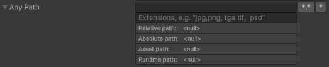

```csharp
using ReferenceAnyPath;
using UnityEngine;

public class AnyPathExample : MonoBehaviour {
    [SerializeField] AnyPath _anyPath;

    void Start() {
        var path = _anyPath.Path;
        Debug.Log(path);
    }
}
```

</details>

<details><summary><b>AnyFile</b></summary>

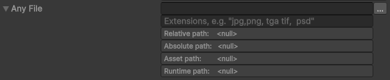

```csharp
using ReferenceAnyPath;
using UnityEngine;

public class AnyFileExample : MonoBehaviour {
    [SerializeField] AnyFile _anyFile;

    void Start() {
        var path = _anyFile.Path;
        Debug.Log(path);
    }
}
```

</details>

<details><summary><b>AnyFolder</b></summary>


```csharp
using ReferenceAnyPath;
using UnityEngine;

public class AnyFolderExample : MonoBehaviour {
    [SerializeField] AnyFolder _anyFolder;

    void Start() {
        var path = _anyFolder.Path;
        Debug.Log(path);
    }
}
```

</details>

---

Asset-based references, primarily for Editor use.

<details><summary><b>Asset</b></summary>

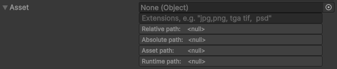

```csharp
using ReferenceAnyPath;
using UnityEngine;

public class AssetExample : MonoBehaviour {
    [SerializeField] Asset _asset;

    void Start() {
        var path = _asset.Path;
        Debug.Log(path);
    }
}
```
</details>

<details><summary><b>Asset<></b></summary>


```csharp
using ReferenceAnyPath;
using UnityEngine;

public class GenericAssetExample : MonoBehaviour {
    [SerializeField] Asset<Material> _asset;

    void Start() {
        var path = _asset.Path;
        Debug.Log(path);
    }
}
```

</details>

<details><summary><b>AssetFile</b></summary>

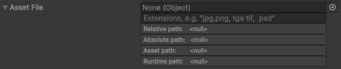

```csharp
using ReferenceAnyPath;
using UnityEngine;

public class AssetFileExample : MonoBehaviour {
    [SerializeField] AssetFile _assetFile;

    void Start() {
        var path = _assetFile.Path;
        Debug.Log(path);
    }
}
```

</details>

<details><summary><b>AssetFolder</b></summary>


```csharp
using ReferenceAnyPath;
using UnityEngine;

public class AssetFolderExample : MonoBehaviour {
    [SerializeField] AssetFolder _assetFolder;

    void Start() {
        var path = _assetFolder.Path;
        Debug.Log(path);
    }
}
```

</details>

---

For any runtime assets: `Resources`, `StreamingAssets`, scenes.

<details><summary><b>RuntimeAsset</b></summary>

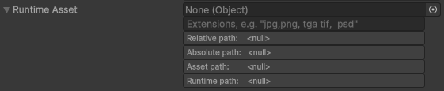

```csharp
using ReferenceAnyPath;
using UnityEngine;

public class RuntimeAssetExample : MonoBehaviour {
    [SerializeField] RuntimeAsset _runtimeAsset;

    void Start() {
        var path = _runtimeAsset.Path;
        Debug.Log(path);
    }
}
```

</details>

<details><summary><b>Runtime<></b></summary>


```csharp
using ReferenceAnyPath;
using UnityEngine;

public class GenericRuntimeAssetExample : MonoBehaviour {
    [SerializeField] Runtime<Material> _runtimeAsset;

    void Start() {
        var path = _runtimeAsset.Path;
        Debug.Log(path);
    }
}
```

</details>

<details><summary><b>RuntimeFile</b></summary>

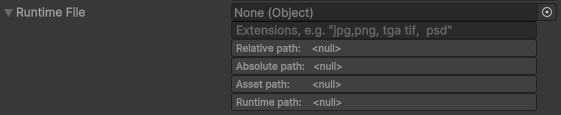

```csharp
using ReferenceAnyPath;
using UnityEngine;

public class RuntimeFileExample : MonoBehaviour {
    [SerializeField] RuntimeFile _runtimeFile;

    void Start() {
        var path = _runtimeFile.Path;
        Debug.Log(path);
    }
}
```

</details>

<details><summary><b>RuntimeFolder</b></summary>

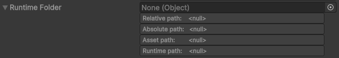

```csharp
using ReferenceAnyPath;
using UnityEngine;

public class RuntimeFolderExample : MonoBehaviour {
    [SerializeField] RuntimeFolder _runtimeFolder;

    void Start() {
        var path = _runtimeFolder.Path;
        Debug.Log(path);
    }
}
```

</details>


---

For storing resource references. Can be used at runtime. Plus, there are resource loading methods available that replicate the methods of the `Resources` class

<details><summary><b>Resource</b></summary>


```csharp
using ReferenceAnyPath;
using UnityEngine;

public class ResourceExample : MonoBehaviour {
    [SerializeField] Resource _resource;

    void Start() {
        var path = _resource.Path;
        Debug.Log(path);
    }
}
```

</details>

<details><summary><b>Resource<></b></summary>


```csharp
using ReferenceAnyPath;
using UnityEngine;

public class GenericResourceExample : MonoBehaviour {
    [SerializeField] Resource<Material> _resource;

    void Start() {
        var path = _resource.Path;
        Debug.Log(path);

        var material = _resource.Load(); 
        // var material = _resource.Load(typeof(Material)); 
        // var material = _resource.Load<Material>();
    }
}
```

```csharp
using System.Collections;
using ReferenceAnyPath;
using UnityEngine;

public class GenericResourceExample : MonoBehaviour {
    [SerializeField] Resource<Material> _resource;

    IEnumerator Start() {
        var path = _resource.Path;
        Debug.Log(path);

        var request = _resource.LoadAsync();
        // var request = _resource.LoadAsync(typeof(Material));
        // var request = _resource.LoadAsync<Material>();
        yield return request;
        var material = request.asset as Material;
    }
}
```

</details>

<details><summary><b>ResourceFile</b></summary>


```csharp
using ReferenceAnyPath;
using UnityEngine;

public class ResourceFileExample : MonoBehaviour {
    [SerializeField] ResourceFile _resourceFile;

    void Start() {
        var path = _resourceFile.Path;
        Debug.Log(path);

        var material = _resourceFile.Load() as Material;
        // var material = _resourceFile.Load(typeof(Material)) as Material;
        // var material = _resourceFile.Load<Material>();
    }
}
```

```csharp
using System.Collections;
using ReferenceAnyPath;
using UnityEngine;

public class ResourceFileExample : MonoBehaviour {
    [SerializeField] ResourceFile _resourceFile;

    IEnumerator Start() {
        var path = _resourceFile.Path;
        Debug.Log(path);

        var request = _resourceFile.LoadAsync();
        // var request = _resourceFile.LoadAsync(typeof(Material));
        // var request = _resourceFile.LoadAsync<Material>();
        yield return request;
        var material = request.asset as Material;
    }
}
```

</details>

<details><summary><b>ResourceFolder</b></summary>

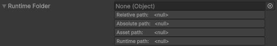

```csharp
using ReferenceAnyPath;
using UnityEngine;

public class ResourceFolderExample : MonoBehaviour {
    [SerializeField] ResourceFolder _resourceFolder;

    void Start() {
        var path = _resourceFolder.Path;
        Debug.Log(path);

        Object[] materials = _resourceFolder.LoadAll();
        // Object[] materials = _resourceFolder.LoadAll(typeof(Material));
        // Material[] materials = _resourceFolder.LoadAll<Material>();
    }
}
```

</details>

<details><summary><b>TextResource</b></summary>


```csharp
using ReferenceAnyPath;
using UnityEngine;

public class TextResourceExample : MonoBehaviour {
    [SerializeField] TextResource _textResource;

    void Start() {
        var path = _textResource.Path;
        Debug.Log(path);

        var text = _textResource.Load();
    }
}
```

```csharp
using System;
using ReferenceAnyPath;
using UnityEngine;

public class TextResourceExample : MonoBehaviour {
    [SerializeField] TextResource _textResource;

    async void Start() {
        var path = _textResource.Path;
        Debug.Log(path);

        try {
            var text = await _textResource.LoadAsync();
        }
        catch (Exception e) {
            Debug.LogException(e);
        }
    }
}
```

```csharp
using System;
using ReferenceAnyPath;
using UnityEngine;

public class TextResourceExample : MonoBehaviour {
    [SerializeField] TextResource _textResource;

    async void Start() {
        var path = _textResource.Path;
        Debug.Log(path);

        try {
            var bytes = await _textResource.LoadAsync(destroyCancellationToken);
        }
        catch (OperationCanceledException) { }
        catch (Exception e) {
            Debug.LogException(e);
        }
    }
}
```

</details>

<details><summary><b>BinaryResource</b></summary>


```csharp
using ReferenceAnyPath;
using UnityEngine;

public class BinaryResourceExample : MonoBehaviour {
    [SerializeField] BinaryResource _binaryResource;

    void Start() {
        var path = _binaryResource.Path;
        Debug.Log(path);

        var bytes = _binaryResource.Load();
    }
}
```

```csharp
using System;
using ReferenceAnyPath;
using UnityEngine;

public class BinaryResourceExample : MonoBehaviour {
    [SerializeField] BinaryResource _binaryResource;

    async void Start() {
        var path = _binaryResource.Path;
        Debug.Log(path);

        try {
            var bytes = await _binaryResource.LoadAsync();
        }
        catch (Exception e) {
            Debug.LogException(e);
        }
    }
}
```

```csharp
using System;
using ReferenceAnyPath;
using UnityEngine;

public class BinaryResourceExample : MonoBehaviour {
    [SerializeField] BinaryResource _binaryResource;

    async void Start() {
        var path = _binaryResource.Path;
        Debug.Log(path);

        try {
            var bytes = await _binaryResource.LoadAsync(destroyCancellationToken);
        }
        catch (OperationCanceledException) { }
        catch (Exception e) {
            Debug.LogException(e);
        }
    }
}
```

</details>

---

For referencing assets in the `StreamingAssets` folder. Can be used in runtime.

<details><summary><b>StreamingAsset</b></summary>


```csharp
using ReferenceAnyPath;
using UnityEngine;

public class StreamingAssetExample : MonoBehaviour {
    [SerializeField] StreamingAsset _streamingAsset;

    void Start() {
        var path = _streamingAsset.Path; // Path within StreamingAssets folder
        Debug.Log(path);

        var streamingAssetPath = _streamingAsset.StreamingAssetPath; // Path with StreamingAssets folder
        Debug.Log(streamingAssetPath);
    }
}
```

</details>

<details><summary><b>StreamingAssetFile</b></summary>


```csharp
using System;
using ReferenceAnyPath;
using UnityEngine;

public class StreamingAssetFileExample : MonoBehaviour {
    [SerializeField] StreamingAssetFile _streamingAssetFile;

    async void Start() {
        var path = _streamingAssetFile.Path; // Path within StreamingAssets folder
        Debug.Log(path);

        var streamingAssetPath = _streamingAssetFile.StreamingAssetPath; // Path with StreamingAssets folder
        Debug.Log(streamingAssetPath);

        try {
            var text = await _streamingAssetFile.ReadAllTextAsync();
            // var bytes = await _streamingAssetFile.ReadAllBytesAsync();
        }
        catch (Exception e) {
            Debug.LogException(e);
        }
    }
}
```

```csharp
using System;
using ReferenceAnyPath;
using UnityEngine;

public class StreamingAssetFileExample : MonoBehaviour {
    [SerializeField] StreamingAssetFile _streamingAssetFile;

    async void Start() {
        var path = _streamingAssetFile.Path; // Path within StreamingAssets folder
        Debug.Log(path);

        var streamingAssetPath = _streamingAssetFile.StreamingAssetPath; // Path with StreamingAssets folder
        Debug.Log(streamingAssetPath);

        try {
            var text = await _streamingAssetFile.ReadAllTextAsync(destroyCancellationToken);
            // var bytes = await _streamingAssetFile.ReadAllBytesAsync(destroyCancellationToken);
        }
        catch (OperationCanceledException) { }
        catch (Exception e) {
            Debug.LogException(e);
        }
    }
}

```

</details>

<details><summary><b>StreamingAssetFolder</b></summary>


```csharp
using ReferenceAnyPath;
using UnityEngine;

public class StreamingAssetFolderExample : MonoBehaviour {
    [SerializeField] StreamingAssetFolder _streamingAssetFolder;

    void Start() {
        var path = _streamingAssetFolder.Path; // Path within StreamingAssets folder
        Debug.Log(path);

        var streamingAssetPath = _streamingAssetFolder.StreamingAssetPath; // Path with StreamingAssets folder
        Debug.Log(streamingAssetPath);
    }
}
```

</details>

<details><summary><b>TextStreamingAsset</b></summary>

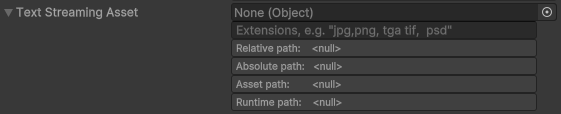

```csharp
using System;
using ReferenceAnyPath;
using UnityEngine;

public class TextStreamingAssetExample : MonoBehaviour {
    [SerializeField] TextStreamingAsset _textStreamingAsset;

    async void Start() {
        var path = _textStreamingAsset.Path; // Path within StreamingAssets folder
        Debug.Log(path);

        var streamingAssetPath = _textStreamingAsset.StreamingAssetPath; // Path with StreamingAssets folder
        Debug.Log(streamingAssetPath);

        try {
            var text = await _textStreamingAsset.ReadAllTextAsync();
        }
        catch (Exception e) {
            Debug.LogException(e);
        }
    }
}
```

```csharp
using System;
using ReferenceAnyPath;
using UnityEngine;

public class TextStreamingAssetExample : MonoBehaviour {
    [SerializeField] TextStreamingAsset _textStreamingAsset;

    async void Start() {
        var path = _textStreamingAsset.Path; // Path within StreamingAssets folder
        Debug.Log(path);

        var streamingAssetPath = _textStreamingAsset.StreamingAssetPath; // Path with StreamingAssets folder
        Debug.Log(streamingAssetPath);

        try {
            var text = await _textStreamingAsset.ReadAllTextAsync(destroyCancellationToken);
        }
        catch (OperationCanceledException) { }
        catch (Exception e) {
            Debug.LogException(e);
        }
    }
}
```

</details>

<details><summary><b>BinaryStreamingAsset</b></summary>


```csharp
using System;
using ReferenceAnyPath;
using UnityEngine;

public class BinaryStreamingAssetExample : MonoBehaviour {
    [SerializeField] BinaryStreamingAsset _binaryStreamingAsset;

    async void Start() {
        var path = _binaryStreamingAsset.Path; // Path within StreamingAssets folder
        Debug.Log(path);

        var streamingAssetPath = _binaryStreamingAsset.StreamingAssetPath; // Path with StreamingAssets folder
        Debug.Log(streamingAssetPath);

        try {
            var bytes = await _binaryStreamingAsset.ReadAllBytesAsync();
        }
        catch (Exception e) {
            Debug.LogException(e);
        }
    }
}
```

```csharp
using System;
using ReferenceAnyPath;
using UnityEngine;

public class BinaryStreamingAssetExample : MonoBehaviour {
    [SerializeField] BinaryStreamingAsset _binaryStreamingAsset;

    async void Start() {
        var path = _binaryStreamingAsset.Path; // Path within StreamingAssets folder
        Debug.Log(path);

        var streamingAssetPath = _binaryStreamingAsset.StreamingAssetPath; // Path with StreamingAssets folder
        Debug.Log(streamingAssetPath);

        try {
            var bytes = await _binaryStreamingAsset.ReadAllBytesAsync(destroyCancellationToken);
        }
        catch (OperationCanceledException) { }
        catch (Exception e) {
            Debug.LogException(e);
        }
    }
}
```

</details>

---

For referencing scenes. Exposes the scene path and the scene name for use in runtime.

<details><summary><b>Scene</b></summary>


```csharp
using UnityEngine;
using UnityEngine.SceneManagement;
using Scene = ReferenceAnyPath.Scene;

public class SceneExample : MonoBehaviour {
    [SerializeField] Scene _scene;

    void Start() {
        var path = _scene.Path;
        Debug.Log(path);

        var sceneName = _scene.Name;
        Debug.Log(sceneName);

        _scene.LoadScene();
        // _scene.LoadScene(LoadSceneMode.Additive);
        // _scene.LoadScene(new LoadSceneParameters {
        //     loadSceneMode = LoadSceneMode.Single,
        //     localPhysicsMode = LocalPhysicsMode.Physics2D
        // });
    }
}
```

```csharp
using System.Collections;
using UnityEngine;
using UnityEngine.SceneManagement;
using Scene = ReferenceAnyPath.Scene;

public class SceneExample : MonoBehaviour {
    [SerializeField] Scene _scene;

    IEnumerator Start() {
        var path = _scene.Path;
        Debug.Log(path);

        var sceneName = _scene.Name;
        Debug.Log(sceneName);

        yield return _scene.LoadSceneAsync();
        // yield return _scene.LoadSceneAsync(LoadSceneMode.Additive);
        // yield return _scene.LoadSceneAsync(new LoadSceneParameters {
        //     loadSceneMode = LoadSceneMode.Single,
        //     localPhysicsMode = LocalPhysicsMode.Physics2D
        // });
    }
}
```

</details>

---

Raw heightmaps are used by Unity Terrains, but Unity doesn't have a proper type to reference them. This is an attempt to create one. Besides referencing the file itself, it also allows you to input some additional data required for a heightmap to be properly parsed: Width, Height, Bits, ByteOrder and Flip properties. Note that there is no validation of these values.

<details><summary><b>RawHeightmapFile</b></summary>

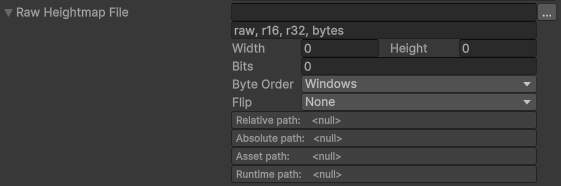

```csharp
using ReferenceAnyPath;
using UnityEngine;

public class RawHeightmapFileExample : MonoBehaviour {
    [SerializeField] RawHeightmapFile _rawHeightmapFile;

    void Start() {
        var path = _rawHeightmapFile.Path;
        Debug.Log(path);

        var width = _rawHeightmapFile.Width;
        var height = _rawHeightmapFile.Height;
        var bits = _rawHeightmapFile.Bits;
        var byteOrder = _rawHeightmapFile.ByteOrder;
        var flip = _rawHeightmapFile.Flip;
        Debug.Log($"w: {width}, h: {height}, bits: {bits}, byte order: {byteOrder}, flip: {flip}");
    }
}
```

</details>

<details><summary><b>RawHeightmapAsset</b></summary>

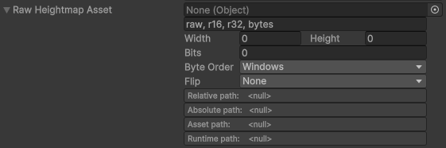

```csharp
using ReferenceAnyPath;
using UnityEngine;

public class RawHeightmapAssetExample : MonoBehaviour {
    [SerializeField] RawHeightmapAsset _rawHeightmapAsset;

    void Start() {
        var path = _rawHeightmapAsset.Path;
        Debug.Log(path);

        var width = _rawHeightmapAsset.Width;
        var height = _rawHeightmapAsset.Height;
        var bits = _rawHeightmapAsset.Bits;
        var byteOrder = _rawHeightmapAsset.ByteOrder;
        var flip = _rawHeightmapAsset.Flip;
        Debug.Log($"w: {width}, h: {height}, bits: {bits}, byte order: {byteOrder}, flip: {flip}");
    }
}
```

</details>

<details><summary><b>RawHeightmapRuntimeAsset</b></summary>

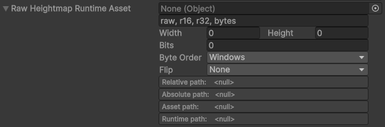

```csharp
using ReferenceAnyPath;
using UnityEngine;

public class RawHeightmapRuntimeAssetExample : MonoBehaviour {
    [SerializeField] RawHeightmapRuntimeAsset _rawHeightmapRuntimeAsset;

    void Start() {
        var path = _rawHeightmapRuntimeAsset.Path;
        Debug.Log(path);

        var width = _rawHeightmapRuntimeAsset.Width;
        var height = _rawHeightmapRuntimeAsset.Height;
        var bits = _rawHeightmapRuntimeAsset.Bits;
        var byteOrder = _rawHeightmapRuntimeAsset.ByteOrder;
        var flip = _rawHeightmapRuntimeAsset.Flip;
        Debug.Log($"w: {width}, h: {height}, bits: {bits}, byte order: {byteOrder}, flip: {flip}");
    }
}
```

</details>

<details><summary><b>RawHeightmapResource</b></summary>

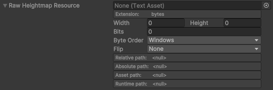

```csharp
using ReferenceAnyPath;
using UnityEngine;

public class RawHeightmapResourceExample : MonoBehaviour {
    [SerializeField] RawHeightmapResource _rawHeightmapResource;

    void Start() {
        var path = _rawHeightmapResource.Path;
        Debug.Log(path);

        var width = _rawHeightmapResource.Width;
        var height = _rawHeightmapResource.Height;
        var bits = _rawHeightmapResource.Bits;
        var byteOrder = _rawHeightmapResource.ByteOrder;
        var flip = _rawHeightmapResource.Flip;
        Debug.Log($"w: {width}, h: {height}, bits: {bits}, byte order: {byteOrder}, flip: {flip}");

        var bytes = _rawHeightmapResource.Load();
    }
}
```

```csharp
using System;
using ReferenceAnyPath;
using UnityEngine;

public class RawHeightmapResourceExample : MonoBehaviour {
    [SerializeField] RawHeightmapResource _rawHeightmapResource;

    async void Start() {
        var path = _rawHeightmapResource.Path;
        Debug.Log(path);

        var width = _rawHeightmapResource.Width;
        var height = _rawHeightmapResource.Height;
        var bits = _rawHeightmapResource.Bits;
        var byteOrder = _rawHeightmapResource.ByteOrder;
        var flip = _rawHeightmapResource.Flip;
        Debug.Log($"w: {width}, h: {height}, bits: {bits}, byte order: {byteOrder}, flip: {flip}");

        try {
            var bytes = await _rawHeightmapResource.LoadAsync();
        }
        catch (Exception e) {
            Debug.LogException(e);
        }
    }
}
```

```csharp
using System;
using ReferenceAnyPath;
using UnityEngine;

public class RawHeightmapResourceExample : MonoBehaviour {
    [SerializeField] RawHeightmapResource _rawHeightmapResource;

    async void Start() {
        var path = _rawHeightmapResource.Path;
        Debug.Log(path);

        var width = _rawHeightmapResource.Width;
        var height = _rawHeightmapResource.Height;
        var bits = _rawHeightmapResource.Bits;
        var byteOrder = _rawHeightmapResource.ByteOrder;
        var flip = _rawHeightmapResource.Flip;
        Debug.Log($"w: {width}, h: {height}, bits: {bits}, byte order: {byteOrder}, flip: {flip}");

        try {
            var bytes = await _rawHeightmapResource.LoadAsync(destroyCancellationToken);
        }
        catch (OperationCanceledException) { }
        catch (Exception e) {
            Debug.LogException(e);
        }
    }
}
```

</details>

<details><summary><b>RawHeightmapStreamingAsset</b></summary>

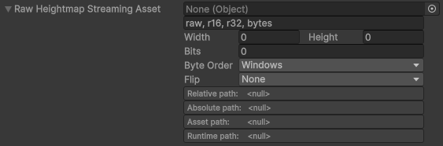

```csharp
using System;
using ReferenceAnyPath;
using UnityEngine;

public class RawHeightmapStreamingAssetExample : MonoBehaviour {
    [SerializeField] RawHeightmapStreamingAsset _rawHeightmapStreamingAsset;

    async void Start() {
        var path = _rawHeightmapStreamingAsset.Path; // Path within StreamingAssets folder
        Debug.Log(path);

        var streamingAssetPath = _rawHeightmapStreamingAsset.StreamingAssetPath; // Path with StreamingAssets folder
        Debug.Log(streamingAssetPath);

        var width = _rawHeightmapStreamingAsset.Width;
        var height = _rawHeightmapStreamingAsset.Height;
        var bits = _rawHeightmapStreamingAsset.Bits;
        var byteOrder = _rawHeightmapStreamingAsset.ByteOrder;
        var flip = _rawHeightmapStreamingAsset.Flip;
        Debug.Log($"w: {width}, h: {height}, bits: {bits}, byte order: {byteOrder}, flip: {flip}");

        try {
            var bytes = await _rawHeightmapStreamingAsset.ReadAllBytesAsync();
        }
        catch (Exception e) {
            Debug.LogException(e);
        }
    }
}
```

```csharp
using System;
using ReferenceAnyPath;
using UnityEngine;

public class RawHeightmapStreamingAssetExample : MonoBehaviour {
    [SerializeField] RawHeightmapStreamingAsset _rawHeightmapStreamingAsset;

    async void Start() {
        var path = _rawHeightmapStreamingAsset.Path; // Path within StreamingAssets folder
        Debug.Log(path);

        var streamingAssetPath = _rawHeightmapStreamingAsset.StreamingAssetPath; // Path with StreamingAssets folder
        Debug.Log(streamingAssetPath);

        var width = _rawHeightmapStreamingAsset.Width;
        var height = _rawHeightmapStreamingAsset.Height;
        var bits = _rawHeightmapStreamingAsset.Bits;
        var byteOrder = _rawHeightmapStreamingAsset.ByteOrder;
        var flip = _rawHeightmapStreamingAsset.Flip;
        Debug.Log($"w: {width}, h: {height}, bits: {bits}, byte order: {byteOrder}, flip: {flip}");

        try {
            var bytes = await _rawHeightmapStreamingAsset.ReadAllBytesAsync(destroyCancellationToken);
        }
        catch (OperationCanceledException) { }
        catch (Exception e) {
            Debug.LogException(e);
        }
    }
}
```
</details>

---

### Extensions

You can restrict file references even further by adding a list of extensions. `,` and ` ` can be used as separators. This is not supported for folders and not supported for generics (as restrictions are already applied via generic parameter).

---

### Editor and Unsafe methods

#### Runtime

- `Path` - runtime path for use in runtime/builds
- `PathUnsafe` - unsafe version for convenience

Unsafe path is the "packed" version of the path that Unity actually serializes. The reason for this is that unity `SerializedProperty` doesn't distinguish between `null` and empty strings and stores them as empty. But the empty string is a valid path for a folder in various cases (e.g., `Resources` or `Assets` folder). So to overcome this limitation, this info is "packed" into the serialized path:

| PathUnsafe | Path      |
|------------|-----------|
| ""         | null      | 
| "."        | ""        |
| some path  | some path |

`Path` unpacks the data, `PathUnsafe` gives access to the actual value.

#### Editor-only

- `AbsolutePath`
- `RelativePath`
- `AssetPath`
- `RuntimePath`

Each of them not only unpacks the data just like `Path` does, but also checks the path for existence. `AbsolutePath` and `RelativePath` access the disc and `AssetPath` and `RuntimePath` access the `AssetDatabase`. Avoid using these methods in the main Editor/application loop, instead consider using unsafe alternatives:

- `AbsolutePathUnsafe`
- `RelativePathUnsafe`
- `AssetPathUnsafe`
- `RuntimePathUnsafe`

Unsafe methods simply return what is stored in a property; packing is the same as for `Path`.

---

### Interfaces

Runtime types feature a comprehensive set of interfaces. This is especially useful for Dependency Injection. But you can use them whenever you see fit.

<details><summary>Runtime interfaces</summary>

```csharp
#if UNITY_EDITOR
    public interface IEditorPaths {
        public string RelativePath { get; }
        public string AbsolutePath { get; }
        public string AssetPath { get; }
        public string RuntimePath { get; }
    }

    public interface IEditorPathsUnsafe : IEditorPaths {
        public string RelativePathUnsafe { get; }
        public string AbsolutePathUnsafe { get; }
        public string AssetPathUnsafe { get; }
        public string RuntimePathUnsafe { get; }
    }
#endif

#if UNITY_EDITOR
    public interface IPath : IEditorPaths {
#else
    public interface IPath {
#endif
        public string Path { get; }
    }

#if UNITY_EDITOR
    public interface IPathUnsafe : IPath, IEditorPathsUnsafe {
#else
    public interface IPathUnsafe : IPath {
#endif
        public string PathUnsafe { get; }
    }

    public interface IAnyPath : IPathUnsafe { }
    public interface IAnyFile : IAnyPath { }
    public interface IAnyFolder : IAnyPath { }

    public interface IAsset : IAnyPath { }
    public interface IAssetFile : IAsset, IAnyFile { }
    public interface IAssetFolder : IAsset, IAnyFolder { }

    public interface IRuntimeAsset : IAsset { }
    public interface IRuntimeFile : IRuntimeAsset, IAssetFile { }
    public interface IRuntimeFolder : IRuntimeAsset, IAssetFolder { }

    public interface IResource : IRuntimeAsset { }

    public interface IResourceFile : IResource, IRuntimeFile { }

    public interface ITextResourceFile : IResourceFile {
        public string Load();

#if REFERENCE_ANY_PATH_FORCE_UNITASK
        public UniTask<string> LoadAsync();
        public UniTask<string> LoadAsync(CancellationToken cancellationToken);
#elif UNITY_2023_1_OR_NEWER
        public Awaitable<string> LoadAsync();
        public Awaitable<string> LoadAsync(CancellationToken cancellationToken);
#else
        public Task<string> LoadAsync();
        public Task<string> LoadAsync(CancellationToken cancellationToken);
#endif
    }

    public interface IBinaryResourceFile : IResourceFile {
        public byte[] Load();

#if REFERENCE_ANY_PATH_FORCE_UNITASK
        public UniTask<byte[]> LoadAsync();
        public UniTask<byte[]> LoadAsync(CancellationToken cancellationToken);
#elif UNITY_2023_1_OR_NEWER
        public Awaitable<byte[]> LoadAsync();
        public Awaitable<byte[]> LoadAsync(CancellationToken cancellationToken);
#else
        public Task<byte[]> LoadAsync();
        public Task<byte[]> LoadAsync(CancellationToken cancellationToken);
#endif
    }

    public interface IResourceFile<TObject> : IResourceFile {
        public TObject Load();
        public T Load<T>() where T : TObject;
        public TObject Load(Type systemTypeInstance);
        public ResourceRequest LoadAsync();
        public ResourceRequest LoadAsync<T>() where T : TObject;
        public ResourceRequest LoadAsync(Type systemTypeInstance);
    }

    public interface IResourceFolder : IResource, IRuntimeFolder {
        public UnityObject[] LoadAll();
        public T[] LoadAll<T>() where T : UnityObject;
        public UnityObject[] LoadAll(Type systemTypeInstance);
    }

    public interface IStreamingAsset : IRuntimeAsset {
        public string StreamingAssetPath { get; }
    }

    public interface IStreamingAssetFile : IStreamingAsset, IRuntimeFile { }

    public interface ITextStreamingAssetFile : IStreamingAssetFile {
#if REFERENCE_ANY_PATH_FORCE_UNITASK
        public UniTask<string> ReadAllTextAsync();
        public UniTask<string> ReadAllTextAsync(CancellationToken cancellationToken);
#elif UNITY_2023_1_OR_NEWER
        public Awaitable<string> ReadAllTextAsync();
        public Awaitable<string> ReadAllTextAsync(CancellationToken cancellationToken);
#else
        public Task<string> ReadAllTextAsync();
        public Task<string> ReadAllTextAsync(CancellationToken cancellationToken);
#endif
    }

    public interface IBinaryStreamingAssetFile : IStreamingAssetFile {
#if REFERENCE_ANY_PATH_FORCE_UNITASK
        public UniTask<byte[]> ReadAllBytesAsync();
        public UniTask<byte[]> ReadAllBytesAsync(CancellationToken cancellationToken);
#elif UNITY_2023_1_OR_NEWER
        public Awaitable<byte[]> ReadAllBytesAsync();
        public Awaitable<byte[]> ReadAllBytesAsync(CancellationToken cancellationToken);
#else
        public Task<byte[]> ReadAllBytesAsync();
        public Task<byte[]> ReadAllBytesAsync(CancellationToken cancellationToken);
#endif
    }

    public interface IStreamingAssetFolder : IStreamingAsset, IRuntimeFolder { }

    public interface IScene : IRuntimeFile {
        public string Name { get; }
        public void LoadScene();
        public void LoadScene(LoadSceneMode mode);
        public void LoadScene(LoadSceneParameters parameters);
        public AsyncOperation LoadSceneAsync();
        public AsyncOperation LoadSceneAsync(LoadSceneMode mode);
        public AsyncOperation LoadSceneAsync(LoadSceneParameters parameters);
    }

    public interface IRawHeightmap : IAnyFile {
        public int Width { get;}
        public int Height { get;}
        public int Bits { get;}
        public ByteOrder ByteOrder { get; }
        public Flip Flip { get; }
    }

    public interface IRawHeightmapFile : IRawHeightmap { }
    public interface IRawHeightmapAsset : IRawHeightmap, IAssetFile { }
    public interface IRawHeightmapRuntimeAsset : IRawHeightmap, IRuntimeFile { }
    public interface IRawHeightmapResource : IRawHeightmap, IBinaryResourceFile { }
    public interface IRawHeightmapStreamingAsset : IRawHeightmap, IBinaryStreamingAssetFile { }
```
</details>

---

## Limitations

### 1. Unity version requirements

**Unity 2021.2.18f1** or above is required because this package relies on both serialization of generic types and Editor-only fields support.

### 2. Generics within generics

E.g. `[SerializeField] List<Resource<Material>> _material;`.

While Unity now supports generic type serialization and Editor-only fields, you can't use them this way. This code will fail with the classic layout error:

```
A scripted object (probably <serialized object type>?) has a different serialization layout when loading. (Read <N> bytes but expected <M> bytes)
Did you #ifdef UNITY_EDITOR a section of your serialized properties in any of your scripts?
```

Important note: this error is somewhat random, sometimes the built application gives you the error, sometimes not, sometimes the build crashes on startup with a more cryptic error.

So the advice is to **not use generics within generics.**

Suggested workarounds:
- Either use non-generics, e.g. `[SerializeField] List<Resource>_material;`.
- or subclass a generic, e.g. `public class ResourceMaterial : Resource<Material> { }` and then use it instead: `[SerializeField] List<ResourceMaterial> _material;`.

### 3. Path limitations

**Reference Any Path** is designed to store the relative path. The absolute path is recreated from it via the [Path](https://learn.microsoft.com/en-us/dotnet/api/system.io.path) API. Windows-only paths are not properly supported by this API on other platforms, so you should likely avoid the use of UNC paths (e.g. `//server/share`), as well as `//./` and `//?/` path prefixes.

In addition, pointing to another drive on Windows will result in a platform-specific absolute path that will make no sense on other systems, and even on Windows itself where no such drive exists. So I consider all these paths as platform-specific and don't treat them in any special way, except some minor workarounds for inconsistent behavior of the Path API.

Also, `file://`-prefixed paths aren't supported.

### 4. Other limitations:

<details><summary><b>Asset validation</b></summary>

`AnyPath`, `AnyFile`, `AnyFolder` and `RawHeightmapFile` are path-based. When they reference assets within your Unity project, and you move these assets, changes are not reflected.

Suggested workaround: use any other available type that is asset-based.

</details>

<details><summary><b>Resources</b></summary>

Unity doesn't use file extensions when loading Resources in runtime. This means that if you have e.g. `Text.md` and `Text.txt` files in the same folder, they both can coexist there but in runtime the path will be the same for both files.

Suggested workaround:
- Name your resources of the same type differently or put them in separate folders.
- For resources of different types with the same name, use generics, e.g. `[SerializeField] Resource<Material> _material;`, `[SerializeField] Resource<TextAsset> _textAsset;` etc.

</details>

<details><summary><b>Streaming Assets</b></summary>

#### Streaming Assets serialize differently

When moving assets within Unity, you can lose references if you move them to and from `StreamingAssets` folder. This is because assets in that folder don't stay the same object as when they are outside it:
- when an object is referenced while outside the `StreamingAssets` folder, and then is moved to that folder, the reference and the path survive.

- When an object is referenced while inside the `StreamingAssets` folder, and then is moved outside that folder - its reference does not survive and its paths don't change.

- The exception is folders: they can be moved to and from `StreamingAssets` without any issues.

#### Folder loading is not supported

As some major platforms (Android and WebGL) don't allow the use of the .NET `File` API, listing files in folders is not supported, and bulk loading a folder is not possible. There are some known workarounds, at least for Android, but they are far from being perfect.

</details>

<details><summary><b>OnBeforeSerialize</b></summary>

**Reference Any Path** uses `AssetDatabase` to validate asset-based paths, and also handles moved or deleted files automatically. This is done in `OnBeforeSerialize` which is a somewhat special method, and
Unity is not very transparent on what you may or may not use there.

`AssetDatabase.GetAssetPath()` can't be used there, as it triggers the annoying `Objects are trying to be loaded during a domain backup. This is not allowed as it will lead to undefined behaviour!` error message. So the workaround is to use few other `AssetDatabase` API methods that don't trigger any errors. But I can imagine errors returning in some future Unity versions. So,
**Reference Any Path** provides the `REFERENCE_ANY_PATH_NO_VALIDATION_BEFORE_SERIALIZATION` Scripting Define to remove the path check and the restoration code from `OnBeforeSerialize`.

</details>

<details><summary><b>PropertyDrawer</b></summary>

Non-asset paths are validated in a thread to avoid blocking the Editor UI with disc access. The validation starts when the UI updates, and it synchronizes back when the thread completes. When the path validation state changes, it triggers the repaint of some Editor windows. While the performance impact is minor, there is the `REFERENCE_ANY_PATH_NO_ASYNC_CHECK_IN_INSPECTOR` Scripting Define that removes the parallel validation from `PropertyDrawer`. Note that only `AnyPath`, `AnyFile`, `AnyFolder` and `RawHeightmapFile` are affected by this. Asset-based paths are validated synchronously via Unity APIs.

</details>

---

### Scripting defines

- REFERENCE_ANY_PATH_NO_VALIDATION_BEFORE_SERIALIZATION — removes path check and restoration code from `OnBeforeSerialize`.

- REFERENCE_ANY_PATH_NO_PARALLEL_CHECK_IN_INSPECTOR — removes non-asset paths validation from `PropertyDrawer`.

- REFERENCE_ANY_PATH_FORCE_UNITASK — forces the use of UniTask for async/parallel operations. Only enable it if you have UniTask in your project. Also, I would probably suggest not using this at all, unless you have performance issues or some other issues with the tasks.

---

## License

### [MIT](LICENSE.md)

```
Copyright (c) 2024-2025 Vladimir Klubkov

Permission is hereby granted, free of charge, to any person obtaining a copy
of this software and associated documentation files (the "Software"), to deal
in the Software without restriction, including without limitation the rights
to use, copy, modify, merge, publish, distribute, sublicense, and/or sell
copies of the Software, and to permit persons to whom the Software is
furnished to do so, subject to the following conditions:

The above copyright notice and this permission notice shall be included in all
copies or substantial portions of the Software.

THE SOFTWARE IS PROVIDED "AS IS", WITHOUT WARRANTY OF ANY KIND, EXPRESS OR
IMPLIED, INCLUDING BUT NOT LIMITED TO THE WARRANTIES OF MERCHANTABILITY,
FITNESS FOR A PARTICULAR PURPOSE AND NONINFRINGEMENT. IN NO EVENT SHALL THE
AUTHORS OR COPYRIGHT HOLDERS BE LIABLE FOR ANY CLAIM, DAMAGES OR OTHER
LIABILITY, WHETHER IN AN ACTION OF CONTRACT, TORT OR OTHERWISE, ARISING FROM,
OUT OF OR IN CONNECTION WITH THE SOFTWARE OR THE USE OR OTHER DEALINGS IN THE
SOFTWARE.
```

### [Third Party Notices](Third%20Party%20Notices.md)

Package was inspired by (and thus may contain some similarities to) [UnityResourceReference](https://github.com/paulhayes/UnityResourceReference) by Paul Hayes, also distributed under MIT license:

```
The MIT License (MIT)

Copyright (c) 2014 Paul Hayes

Permission is hereby granted, free of charge, to any person obtaining a copy
of this software and associated documentation files (the "Software"), to deal
in the Software without restriction, including without limitation the rights
to use, copy, modify, merge, publish, distribute, sublicense, and/or sell
copies of the Software, and to permit persons to whom the Software is
furnished to do so, subject to the following conditions:

The above copyright notice and this permission notice shall be included in all
copies or substantial portions of the Software.

THE SOFTWARE IS PROVIDED "AS IS", WITHOUT WARRANTY OF ANY KIND, EXPRESS OR
IMPLIED, INCLUDING BUT NOT LIMITED TO THE WARRANTIES OF MERCHANTABILITY,
FITNESS FOR A PARTICULAR PURPOSE AND NONINFRINGEMENT. IN NO EVENT SHALL THE
AUTHORS OR COPYRIGHT HOLDERS BE LIABLE FOR ANY CLAIM, DAMAGES OR OTHER
LIABILITY, WHETHER IN AN ACTION OF CONTRACT, TORT OR OTHERWISE, ARISING FROM,
OUT OF OR IN CONNECTION WITH THE SOFTWARE OR THE USE OR OTHER DEALINGS IN THE
SOFTWARE.
```